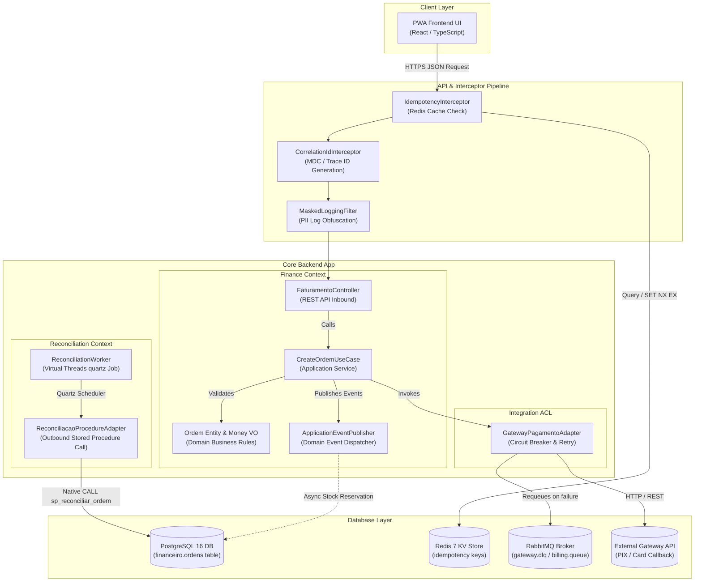

# **📋 Software Design Document: SincronizaMEI — Fault-Tolerant Financial Reconciliation ERP**

**Role:** Kalyel N. Laurindo / Software Engineer  

**Objective:** Detail the technical implementation, architectural patterns, frameworks, and deployment topologies required to execute the business vision.

**Context:** SincronizaMEI is a modular monolithic ERP designed to enforce core business rules through Project Loom Virtual Threads, Bitemporal PostgreSQL persistence, and Redis-backed HTTP idempotency.

---

## **🏛️ Project Metadata**

* **Client / Segment:** SMB SaaS / Microentrepreneur (MEI) Operations  
* **Date of Creation:** June 26, 2026  
* **Lead Architect:** Kalyel N. Laurindo / Software Engineer  
* **Document Version:** v1.0  
* **Associated Solution Architecture Document:** [README.md](../README.md)

---

## **🛠️ 1. Technical Stack Overview**

### **1.1. Core Architectural Layers Form**

*   **Field 1.1.1 - Frontend / Client Stack:**
    *   *Technology/Framework:* React 18 / TypeScript / Vite / Tailwind CSS
    *   *Technical Rationale:* Single Page Application (SPA) compiled as a progressive web app (PWA) to allow offline-first affordance, fast response times (TTI ≤ 2.5s on 3G), and a dynamic dual-UX dashboard for both MEI and Auditor/Controller profiles.
*   **Field 1.1.2 - Backend Core Stack:**
    *   *Technology/Framework:* Java 21 / Spring Boot 3.2.x (Virtual Threads enabled: `spring.threads.virtual.enabled=true`)
    *   *Technical Rationale:* Java 21 Virtual Threads (Project Loom) allow lightweight execution of thousands of concurrent I/O-bound tasks (reconciliation workers, API calls) without exhausting OS threads.
*   **Field 1.1.3 - Database & Storage Engines:**
    *   *Technology/Framework:* PostgreSQL 16 (Primary) and Redis 7.2 (Idempotency and session cache)
    *   *Technical Rationale:* PostgreSQL 16 is selected for native support of temporal range types (`TSTZRANGE`), partial indexes, and stored procedures to guarantee ACID compliance for complex calculations. Redis 7.2 provides high-performance atomic key-value operations (`SET NX EX`) for L7 idempotency.
*   **Field 1.1.4 - Message Brokers & Queue Managers:**
    *   *Technology/Framework:* RabbitMQ 3.13
    *   *Technical Rationale:* Decouples synchronous HTTP requests from background processing, providing reliable queueing, retry mechanisms, and Dead Letter Exchange (DLX) processing for robust event-driven operations.
*   **Field 1.1.5 - Gateway, Infrastructure & Orchestration:**
    *   *Technology/Framework:* Docker / AWS ECS Fargate / AWS ALB / HashiCorp Vault
    *   *Technical Rationale:* Containerized modular deployments on AWS ECS Fargate ensure elastic horizontal scaling. Vault secures operational keys and credentials (e.g. database secrets, encryption keys).
*   **Field 1.1.6 - Observability & Telemetry:**
    *   *Technology/Framework:* OpenTelemetry / Prometheus / Grafana / Jaeger
    *   *Technical Rationale:* Provides distributed tracing and logs correlated by `X-Correlation-ID` across the client, backend, queues, and database, preventing transactional drift.

---

### **1.2. Technical Traceability Matrix (Pain Point ➔ Technical Module)**

#### **Traceability Entry 1: Transaction Drift ("Money in Limbo")**
*   **System Requirement ID:** RF-01, RF-07, RP-01
*   **Responsible Technical Module:** `reconciliacao` (Quartz jobs, Virtual Threads worker, PostgreSQL `sp_reconciliar_ordem`)

#### **Traceability Entry 2: Duplicate Charges & Race Conditions**
*   **System Requirement ID:** RF-02, RNF-03
*   **Responsible Technical Module:** `api/interceptors/IdempotencyInterceptor.java` using Redis `SET NX EX`

#### **Traceability Entry 3: Historical Audits & Compliance**
*   **System Requirement ID:** RF-04, RF-05, RP-02
*   **Responsible Technical Module:** PostgreSQL schema (Bitemporal columns + `bloquear_delete_fisico` trigger + `fn_estado_bitemporal`)

#### **Traceability Entry 4: PII Exposure in Logs and DB**
*   **System Requirement ID:** RNF-05, RNF-06
*   **Responsible Technical Module:** `infra/security/` (AesGcmEncryptor, `@Masked` annotation, and `MaskedLoggingFilter`)

---

## **🏗️ 2. Architectural Design & Core Patterns**

*   **Field 2.1 - Core Architectural Pattern:** Model-View-Controller (MVC) in Monolith with Bounded Contexts

### **💡 Architectural Pattern Details**

The project is structured as a **Modular Monolith** with strict logical boundaries separating Bounded Contexts (`financeiro`, `estoque`, `rh`). Inter-module communication is asynchronous and event-driven via Spring's `ApplicationEventPublisher`, preventing tight coupling and allowing future microservices extraction.

Inside each bounded context context (such as `financeiro`), a Hexagonal layering layout is enforced:
1. **Domain:** Pure entities, value objects, and domain events with zero external framework dependencies.
2. **Application:** Core use cases (orchestrated as services) calling domain rules.
3. **Infrastructure:** Inbound controllers, outbound database adapters, messaging publishers, and third-party API clients (ACL).

```text
                  +-------------------------------------------------+  
                  |             SincronizaMEI Core App              |  
                  |                                                 |  
[ User Actions ] ===> [ Inbound Controller/CLI ]                     |  
                  |         (Inbound Adapter)                       |  
                  |                 ||                              |  
                  |                 \/                              |  
                  |       [ IUseCaseBoundary ]                      |  
                  |          (Inbound Port)                         |  
                  |                 ||                              |  
                  |                 \/                              |  
                  |    +--------------------------+                 |  
                  |    |      Domain Model        |                 |  
                  |    |  - DomainEntity          |                 |  
                  |    |  - ValueObject           |                 |  
                  |    +--------------------------+                 |  
                  |                 ||                              |  
                  |                 \/                              |  
                  |         [ IRepositoryPort ]                     |  
                  |         (Outbound Port)                         |  
                  |                 ||                              |  
                  +-----------------||------------------------------+  
                                    ||  
                                    \/  
                         [ ConcreteRepository ] ===> [ Persistence/DB ]  
                            (Outbound Adapter)
```

---

### **2.2. Communication Taxonomy**

*   **In-Memory Event Bus:** `ApplicationEventPublisher` using transactional listeners (`@TransactionalEventListener`) firing `AFTER_COMMIT` to execute secondary processes (e.g. stock reservation after invoice payment).
*   **Message Broker / Event Bus:** RabbitMQ queues manage asynchronous billing integrations, retries with exponential backoff, and isolate failed messages in DLQ.
*   **Job Queues:** Quartz Scheduler coordinates background workers using virtual threads to scan for transactions in "limbo" status every 15 minutes.

---

## **🔐 3. Security Architecture & Data Protection**

### **✍️ Security Specification Form**

*   **Field 3.1 - Data In Transit Protocol:** HTTPS TLS 1.3
*   **Field 3.2 - Data At Rest Encryption Standard:** Symmetric AES-256-GCM
*   **Field 3.3 - Password & Key Derivation Function:** bcrypt
*   **Field 3.4 - Access Delegation Protocol:** Role-Based Access Control (RBAC) via JWT claims (`MEI` vs `CONTROLLER`)
*   **Field 3.5 - Emergency Recovery Policy:** Automated database snapshots stored in geographically distinct AWS S3 buckets (retention: 30 days). For key wrapping recovery, AWS KMS / Vault KMS is configured with dual-officer authorization rules.

---

## **🧩 4. Evolutionary Blueprint (Scaling Path)**

*   **Module Extraction Path A:** `reconciliacao` ➔ Decoupled to a dedicated Quartz worker task pulling transactions from a dedicated read-replica.
*   **Module Extraction Path B:** `frontend/` ➔ Mobile transition via a React Native app using the same API REST gateway.

---

## **📐 5. System Component Diagram (C4 Model — Level 3: Inside Core Backend App)**

*   **Field 5.1 - Component Diagram Visualization:**



---

## **📂 6. Data Architecture (Relational & Document Design)**

### **✍️ Data Architecture Form Entry**

*   **Field 6.1 - Primary Database Schemas:** 

```sql
CREATE SCHEMA financeiro;
CREATE SCHEMA auditoria;

CREATE TABLE financeiro.ordens (
    id               UUID           DEFAULT gen_random_uuid() PRIMARY KEY,
    idempotency_key  UUID           NOT NULL,
    cliente_id       UUID           NOT NULL,
    valor_total      NUMERIC(15, 2) NOT NULL,
    moeda            CHAR(3)        NOT NULL DEFAULT 'BRL',
    status           TEXT           NOT NULL,
    -- Bitemporal Dimensions (Valid time & System time)
    valid_from       TIMESTAMPTZ    NOT NULL DEFAULT NOW(),
    valid_to         TIMESTAMPTZ    NOT NULL DEFAULT 'infinity',
    system_init      TIMESTAMPTZ    NOT NULL DEFAULT NOW(),
    system_end       TIMESTAMPTZ    NOT NULL DEFAULT 'infinity',
    -- Rastreabilidade / Traceability
    correlation_id   UUID,
    criado_por       TEXT           NOT NULL,
    CONSTRAINT uq_ordem_ativa UNIQUE (idempotency_key, valid_to)
);

CREATE TABLE auditoria.logs_erro (
    id               BIGSERIAL      PRIMARY KEY,
    contexto         TEXT           NOT NULL,
    chave            TEXT           NOT NULL,
    erro             TEXT           NOT NULL,
    correlation_id   UUID,
    data             TIMESTAMPTZ    NOT NULL DEFAULT NOW()
);
```

*   **Field 6.2 - Indexing & Optimization Strategy:**
    *   `idx_ordens_status_pendente` on `financeiro.ordens (status, valid_from) WHERE status = 'PROCESSAMENTO_PENDENTE' AND valid_to = 'infinity'` (optimizes Quartz worker reads for transactions in limbo).
    *   `idx_ordens_idempotency` on `financeiro.ordens (idempotency_key) WHERE valid_to = 'infinity'` (enforces quick lookup of current versions).

*   **Field 6.3 - Database Automation & Lifecycle Events:**
    *   **Soft Delete Enforcement Trigger:** Physical deletes are blocked at the DB level, requiring bitemporal updates (`valid_to = NOW()`).

```sql
CREATE OR REPLACE FUNCTION financeiro.bloquear_delete_fisico()
RETURNS TRIGGER LANGUAGE plpgsql AS $$
BEGIN
    RAISE EXCEPTION 'DELETE físico proibido em tabelas core. Use valid_to = NOW() para soft-delete bitemporal.';
END;
$$;

CREATE TRIGGER trg_bloquear_delete
    BEFORE DELETE ON financeiro.ordens
    FOR EACH ROW EXECUTE FUNCTION financeiro.bloquear_delete_fisico();
```

---

## **🚀 7. Continuous Integration, Deployment & QA**

*   **Test-Driven Development (TDD) Cycle:** The development cycle strictly follows RED-GREEN-REFACTOR. No production code is merged without unit/integration tests executing successfully.
*   **Quality Gates & Architecture Guardrails:**
    *   **Zero Leakage Rule:** Checked via ArchUnit. The domain layer must not import any classes from infrastructure, database packages, or frameworks.
    *   **Security Scans:** Trivy vulnerability scans and TruffleHog secret scanning executed in GitHub Actions.
*   **Test Isolation Pyramid:**
    *   *Unit Tests:* JUnit 5 and Mockito mock out infrastructure.
    *   *Integration Tests:* Testcontainers spin up PostgreSQL 16 and RabbitMQ 3.13. H2 database is strictly prohibited for integration validation to ensure stored procedure features are fully compatible.
    *   *E2E / Load Tests:* Playwright validates end-to-end user journeys; k6 scripts test scale bottlenecks under load.

---

## **💖 8. User Interface Design System (UI Architecture)**

*   **Field 8.1 - Design Philosophy & Design Tokens:**
    *   *System:* Material Design 3 (Glassmorphism layout).
    *   *Color Palette:* Sleek dark theme using custom HSL colors: Primary `hsl(220, 90%, 56%)`, Dark BG `hsl(222, 47%, 11%)`, Border `rgba(255, 255, 255, 0.08)`.
    *   *Typography:* Google Fonts "Outfit" and "JetBrains Mono" for numeric financial audits.
*   **Field 8.2 - Responsive Viewports & Layouts:** Desktop viewport (1280px+) optimized for dense audit charts; mobile viewport (320px–480px) focused on simplified invoicing (MEI billing actions).

---

## **📈 9. Observability & System Monitoring**

*   **Field 9.1 - Logging Aggregator Strategy:** Logs structured as JSON format containing `traceId`, `correlationId`, and timestamps. Captured by Grafana Loki.
*   **Field 9.2 - Telemetry Metrics collected:**
    *   `ordens_em_limbo_ratio` (percentage of active orders marked as PROCESSAMENTO_PENDENTE for >30 minutes).
    *   `reconciliacao_tempo_p95` (latency of stored procedure execution).
    *   JVM Virtual Thread counts.

---

## **🚀 10. Deployment Topology (Transition Plan)**

### **✍️ Deployment Topology Form Entry**

*   **Field 10.1 - Local / Development Compute:** Local Docker Compose (including app, postgres, redis, rabbitmq, and vault).
*   **Field 10.2 - Production Cloud Compute:** Managed Containers (AWS ECS Fargate).
*   **Field 10.3 - Production Database Engine:** Cloud SQL Managed DB (AWS RDS PostgreSQL 16 Multi-AZ).
*   **Field 10.4 - Routing, DNS & SSL Layer:** AWS ALB (Application Load Balancer) + SSL certificate handling + Route 53 DNS mapping.

---

## **📂 11. Codebase Structure & Directory Standards**

*   **Field 11.1 - Directory Strategy:** Single Repo Monolith (Modular layout)

### **💡 Directory Layout Entry**

*   **Field 11.2 - Codebase Directory Tree:**

```text
SincronizaMEI/
├── .github/
│   └── workflows/
│       ├── ci.yml                 # Build, test, and SAST scanner
│       └── cd-production.yml      # Blue-Green Deployment orchestrator
├── db/
│   ├── migrations/                # Flyway DDL migrations
│   └── procedures/                # Stored Procedures & Functions
│       ├── sp_reconciliar_ordem.sql
│       ├── fn_check_integrity.sql
│       └── fn_estado_bitemporal.sql
├── backend/
│   ├── src/main/java/br/com/sincronizamei/
│   │   ├── api/                   # REST controllers, filters, and interceptors
│   │   │   ├── controllers/
│   │   │   ├── interceptors/      # Idempotency checks
│   │   │   └── filters/           # PII Log Obfuscation
│   │   ├── modules/               # Bounded Context Contexts
│   │   │   ├── financeiro/
│   │   │   ├── estoque/
│   │   │   └── rh/
│   │   ├── reconciliacao/         # Reconciliation Engine (Quartz jobs)
│   │   └── infra/                 # Persistence, security, and message brokers
│   └── src/test/                  # JUnit unit and integration (Testcontainers) tests
├── frontend/
│   ├── src/
│   │   ├── features/              # Dual-UX components (mei-operacional, auditoria)
│   │   ├── hooks/                 # Custom React Hooks (useIdempotentMutation)
│   │   └── store/                 # Zustand state stores
│   └── public/
├── infra/
│   └── terraform/                 # AWS Cloud Provisioning
└── scripts/                       # Local utilities (vault-init-dev.sh)
```

---

## **🧪 12. Validation Strategy & Testing Matrix**

### **✍️ Testing Matrix Form Entry**

*   **Field 12.1 - Unit Testing Framework & Targets:** JUnit 5 / Mockito validating Money VO invariants, hook registry execution timeouts, and entity rules.
*   **Field 12.2 - Integration Testing Framework & Targets:** Testcontainers (PostgreSQL 16) testing bitemporal updates, locking, and trigger blocks.
*   **Field 12.3 - End-to-End Testing Framework & Targets:** Playwright validating dual-UX navigation, and k6 verifying system behavior under heavy transaction peaks.

---

## **📝 13. Architecture Decision Records (ADR)**

*   **ADR-001 (Monolithic MVC with Bounded Contexts):** Enables rapid development, compile-time type-safety, and low latency while maintaining context boundary protection.
*   **ADR-002 (Bitemporal Persistence on PostgreSQL):** Implements `valid_from/to` and `system_init/end` structures to record transactional states retroactively without data loss.
*   **ADR-003 (Redis HTTP Idempotency Interception):** Captures incoming client `X-Idempotency-Key` headers via an interceptor to guarantee single-execution safety of POST/PUT calls.
*   **ADR-004 (AES-256-GCM + Masked Logging):** Resolves LGPD compliance by encrypting PII at rest and obfuscating variables containing sensitive patterns prior to log ingestion.

---

## **🏛️ 14. Code Governance & Naming Standards**

### **✍️ Code Governance Form Entry**

*   **Field 14.1 - Domain Entity Naming Style:** Clean naming (e.g. `Ordem`, `EstoqueItem`)
*   **Field 14.2 - Value Object Naming Style:** Clean naming (e.g. `Money`, `Cpf`)
*   **Field 14.3 - Ports & Interfaces Prefix/Suffix:** Interface Suffix (e.g. `UserRepositoryPort`)
*   **Field 14.4 - Adapters Suffix:** Database Name Suffix (e.g. `UserRepositoryPgAdapter`)

---

## **🛡️ 15. Resilience & Disaster Recovery Plan (DRP)**

### **✍️ Resilience Rules Configurator Form**

*   **Rule 15.1 - Atomic State Mutations (Write Isolation):** Excluded (Delegated to PostgreSQL ACID transactional isolation).
*   **Rule 15.2 - Auto-Healing Schema Validation:** Included. Flyway validates all DDL schema hashes during application startup. If discrepancy is found, boot is aborted.
*   **Rule 15.3 - Backup and Database Replication Strategy:** Multi-AZ RDS replication with automated daily snapshot creation and backup point-in-time recovery window of 7 days.
*   **Rule 15.4 - Queue & Job Persistence Strategy:** Included. RabbitMQ queues are marked as durable; messages are flagged as persistent to survive broker restarts.

---

## **🤝 16. System Service Integration Contracts**

All outbound audit and change events must conform to the following contract structure:

```json
{  
  "event_id": "7f3e9b2c-4a1d-4e8f-b7c2-1a9d3e5f7b2c",  
  "timestamp": "2026-06-26T22:20:00Z",  
  "payload": {  
    "scope_code": "FINANCEIRO",  
    "category": "ORDEM",  
    "change_type": "UPDATE",  
    "raw_diff": {  
      "field": "status",  
      "old_value": "PROCESSAMENTO_PENDENTE",  
      "new_value": "CONCILIADO"  
    },  
    "summarized_explanation": "Reconciliation job updated order status from pending to conciliated."  
  }  
}
```

---

## **📖 17. Ubiquitous Domain Glossary**

*   **Valid Time (Tempo de Validade):** The actual timestamp when a financial event occurred in reality, independent of system ingestion.
*   **System Time (Tempo de Sistema):** The database timestamp indicating precisely when SincronizaMEI wrote the event record.
*   **Reconciliation Worker:** A background scheduling service running Quartz and Virtual Threads to verify pending orders and execute reconciliations.
*   **Transactional Limbo:** An inconsistent state when an order is submitted to a gateway but hasn't received a callback within a 15-minute SLA.
*   **Anti-Corruption Layer (ACL):** Adapters shielding the core finance logic from external gateway REST contract changes.

---

### **💾 Stored Procedure & Function DDL Definitions**

Below are the complete, production-ready stored procedures and functions that implement bitemporal mutations and audit checks:

#### **sp_reconciliar_ordem**
```sql
CREATE OR REPLACE PROCEDURE financeiro.sp_reconciliar_ordem(
    p_idempotency_key   UUID,
    p_valor_confirmado  NUMERIC(15, 2),
    p_correlation_id    UUID DEFAULT NULL
)
LANGUAGE plpgsql AS $$
DECLARE
    v_valor_original  NUMERIC(15, 2);
    v_status_final    TEXT;
    v_ordem_id        UUID;
BEGIN
    BEGIN
        -- Pessimistic locking to prevent race conditions during concurrent reconciliation attempts
        SELECT id, valor_total
        INTO   v_ordem_id, v_valor_original
        FROM   financeiro.ordens
        WHERE  idempotency_key = p_idempotency_key
          AND  valid_to = 'infinity'
          AND  status   = 'PROCESSAMENTO_PENDENTE'
        FOR UPDATE NOWAIT;

        -- Tolerância de R$ 0,50 para taxas/ajustes de gateway
        IF ABS(v_valor_original - p_valor_confirmado) <= 0.50 THEN
            v_status_final := 'CONCILIADO';
        ELSE
            v_status_final := 'DIVERGENTE_AUDITORIA';
        END IF;

        -- Close current bitemporal record version
        UPDATE financeiro.ordens
        SET    valid_to = NOW(),
               system_end = NOW()
        WHERE  id = v_ordem_id;

        -- Insert new active version
        INSERT INTO financeiro.ordens (
            idempotency_key, cliente_id, valor_total, moeda, status,
            valid_from, correlation_id, criado_por
        )
        SELECT
            idempotency_key, cliente_id, p_valor_confirmado, moeda, v_status_final,
            NOW(), COALESCE(p_correlation_id, correlation_id), 'worker_reconciliacao'
        FROM financeiro.ordens
        WHERE id = v_ordem_id;

    EXCEPTION
        WHEN lock_not_available THEN
            RAISE NOTICE 'Ordem % already locked by another worker. Skipping.', p_idempotency_key;
        WHEN no_data_found THEN
            INSERT INTO auditoria.logs_erro (contexto, chave, erro, correlation_id, data)
            VALUES ('sp_reconciliar_ordem', p_idempotency_key::TEXT, 'Order not found in PROCESSAMENTO_PENDENTE state', p_correlation_id, NOW());
            RAISE;
        WHEN OTHERS THEN
            INSERT INTO auditoria.logs_erro (contexto, chave, erro, correlation_id, data)
            VALUES ('sp_reconciliar_ordem', p_idempotency_key::TEXT, SQLERRM, p_correlation_id, NOW());
            RAISE;
    END;
END;
$$;
```

#### **fn_check_integrity**
```sql
CREATE OR REPLACE FUNCTION financeiro.fn_check_integrity(p_idempotency_key UUID)
RETURNS TABLE (
    versao          INT,
    status          TEXT,
    valor_total     NUMERIC(15, 2),
    valid_from      TIMESTAMPTZ,
    valid_to        TIMESTAMPTZ,
    system_init     TIMESTAMPTZ,
    correlation_id  UUID,
    em_limbo        BOOLEAN,
    minutos_limbo   NUMERIC
)
LANGUAGE sql STABLE AS $$
    SELECT
        ROW_NUMBER() OVER (ORDER BY valid_from)::INT AS versao,
        o.status,
        o.valor_total,
        o.valid_from,
        o.valid_to,
        o.system_init,
        o.correlation_id,
        (o.status = 'PROCESSAMENTO_PENDENTE'
            AND o.valid_to = 'infinity'
            AND o.valid_from < NOW() - INTERVAL '30 minutes') AS em_limbo,
        ROUND(EXTRACT(EPOCH FROM (NOW() - o.valid_from)) / 60, 1) AS minutos_limbo
    FROM financeiro.ordens o
    WHERE o.idempotency_key = p_idempotency_key
    ORDER BY o.valid_from ASC;
$$;
```

#### **fn_estado_bitemporal**
```sql
CREATE OR REPLACE FUNCTION financeiro.fn_estado_bitemporal(
    p_idempotency_key UUID,
    p_as_of           TIMESTAMPTZ
)
RETURNS SETOF financeiro.ordens
LANGUAGE sql STABLE AS $$
    SELECT *
    FROM   financeiro.ordens
    WHERE  idempotency_key = p_idempotency_key
      AND  valid_from     <= p_as_of
      AND  valid_to        > p_as_of
      AND  system_init    <= p_as_of
      AND  system_end      > p_as_of;
$$;
```

🏁 **End of Document:** This Software Design Document is a live engineering artifact. Architectural pivots, engine choices, or model changes must be documented via sequential updates here and registered via official ADR entries.
