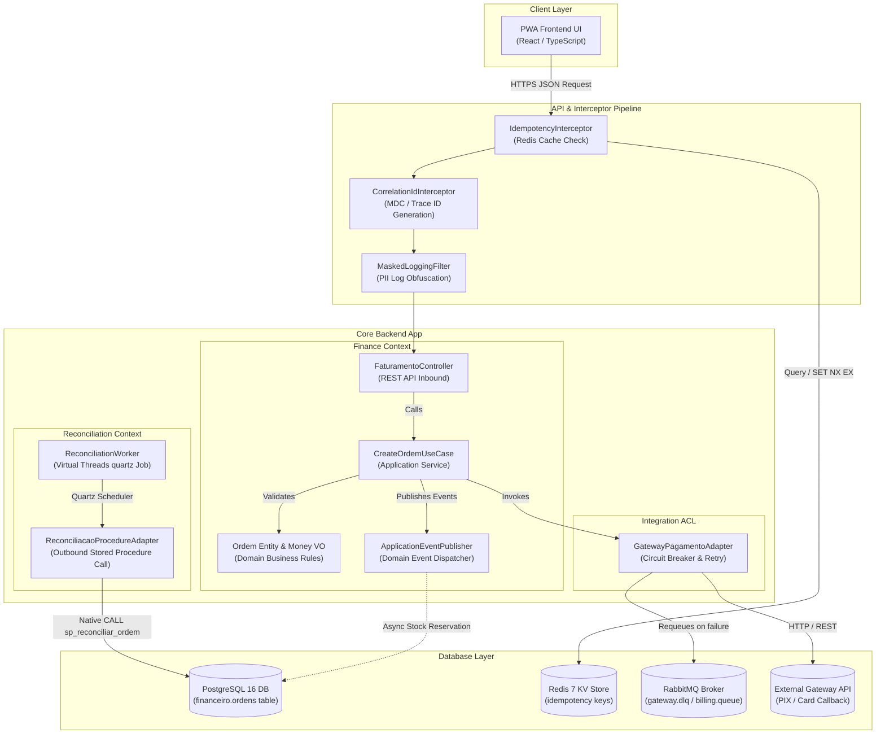

# **📋 Software Design Document: SincronizaMEI — Fault-Tolerant Financial Reconciliation ERP**

**Role:** Kalyel N. Laurindo / Software Engineer  

**Objective:** Detail the technical implementation, architectural patterns, frameworks, and deployment topologies required to execute the business vision.

**Context:** SincronizaMEI is a modular monolithic ERP designed to enforce core business rules through Project Loom Virtual Threads, Bitemporal PostgreSQL persistence, and Redis-backed HTTP idempotency.

---

## **🏛️ Project Metadata**

* **Client / Segment:** SMB SaaS / Microentrepreneur (MEI) Operations  
* **Date of Creation:** June 26, 2026  
* **Lead Architect:** Kalyel N. Laurindo / Software Engineer  
* **Document Version:** v1.1  
* **Associated Solution Architecture Document:** [README.md](../README.md)

> [!NOTE]
> **Legacy Architecture & Naming Convention:** The codebase contains legacy database schemas and package names in Portuguese (e.g., `financeiro`, `ordens`, `auditoria`) inherited from the original system acquisition. To mitigate deployment risks, these naming structures are preserved, while all new documentation, external contracts, and logging standards are unified in Technical English.

---

## **🛠️ 1. Technical Stack Overview**

### **1.1. Core Architectural Layers Form**

| Layer & ID | Technology / Framework | Technical Rationale & Architectural Decisions |
| :--- | :--- | :--- |
| **Field 1.1.1 - Frontend / Client Stack** | React 18 / TypeScript / Vite / Tailwind CSS | Single Page Application (SPA) compiled as a Progressive Web App (PWA) to ensure offline-first support, high performance (TTI &le; 2.5s on 3G), and a responsive dual-UX dashboard tailored for both MEI (invoicing) and Auditor/Controller profiles. |
| **Field 1.1.2 - Backend Core Stack** | Java 21 / Spring Boot 3.2.x | Powered by Java 21 Virtual Threads (Project Loom) to run thousands of concurrent, I/O-bound database queries and gateway reconciliation tasks on lightweight virtual threads without OS thread exhaustion. Uses ArchUnit for architecture enforcement. |
| **Field 1.1.3 - Database & Storage Engines** | PostgreSQL 16 (Primary) / Redis 7.2 (Idempotency & Cache) | PostgreSQL 16 provides ACID guarantees, temporal range types (`TSTZRANGE`), partial indexes, and stored procedures for transaction logic. Redis 7.2 ensures low-latency atomic operations (`SET NX EX`) for HTTP request idempotency. |
| **Field 1.1.4 - Message Brokers & Queue Managers** | RabbitMQ 3.13 | Decouples synchronous API responses (HTTP 202 Accepted) from asynchronous payment processing and reconciliation queues. Manages retry flows via exponential backoff and isolates failed events using Dead Letter Exchanges (DLX). |
| **Field 1.1.5 - Gateway, Infrastructure & Orchestration** | Docker / AWS ECS Fargate / AWS ALB / HashiCorp Vault / Terraform | Standard containerized environments orchestrated via AWS ECS Fargate with AWS ALB routing. HashiCorp Vault handles dynamic and static secrets (API keys, DB passwords). Infrastructure-as-code is declared via Terraform. |
| **Field 1.1.6 - Observability & Telemetry** | OpenTelemetry / Prometheus / Grafana / Jaeger | Implements distributed tracing and metrics aggregation across all layers. Logs are decorated with `traceId` and `correlationId` using MDC to allow quick diagnostics and prevent transaction drift. |

---

### **1.2. Technical Traceability Matrix (Pain Point ➔ Technical Module)**

| User Pain Point & Context | System Requirement ID | Responsible Technical Module | Mitigation Strategy & Implementation Details |
| :--- | :--- | :--- | :--- |
| **Transaction Drift ("Money in Limbo")** <br> Discrepancy between actual payment gateway status and local records. | RF-01, RF-07, RP-01 | `reconciliacao` / `db/procedures/sp_reconciliar_ordem.sql` | Background job (Quartz + Virtual Threads) scans pending orders and triggers PostgreSQL pessimistic lock (`FOR UPDATE NOWAIT`) to settle transactions safely. |
| **Duplicate Charges & Race Conditions** <br> Concurrent payment requests or duplicate webhook retries. | RF-02, RNF-03 | `api/interceptors/IdempotencyInterceptor.java` | Redis-backed filter captures `X-Idempotency-Key` headers using atomic `SET NX EX` with a 24-hour TTL, caching original responses. |
| **Historical Audits & Compliance** <br> Requirement to reconstruct any past state for audit logs. | RF-04, RF-05, RP-02 | `db/migrations/V003__exclusion_constraints_bitemporais.sql` | Bitemporal schema using `valid_from/to` (valid time) and `system_init/end` (system time). A database trigger blocks physical deletions (`BEFORE DELETE`). |
| **PII Exposure in Logs and DB** <br> Compliance violations due to leaking sensitive client data (e.g. CPF, bank info). | RNF-05, RNF-06 | `infra/security/` | Symmetric encryption (`AES-256-GCM`) for PII fields at rest and custom `@Masked` annotation integrated with Logback/MDC to redact logs. |
| **Schema Inconsistency** <br> Inconsistent database structures across environments causing silent runtime crashes. | RP-04, Rule 15.2 | `db/migrations/` | Database DDL managed strictly via Flyway migrations. CI pipeline executes validation dry-runs and hashes schema before release. |
| **Customizations Breaking the Core** <br> Client-specific extensions modifying core code and breaking system stability. | RF-03 | `api/controllers/HookRegistry.java` | Decoupled hook system executing client code asynchronously via `ApplicationEventPublisher` (Spring Events) with explicit fallback logic. |

---

## **🏗️ 2. Architectural Design & Core Patterns**

*   **Field 2.1 - Core Architectural Pattern:** Modular Monolith with Hexagonal Bounded Contexts (Ports & Adapters)

### **💡 Architectural Pattern Details**

*   **Field 2.2 - Design Pattern Description:**
    SincronizaMEI is structured as a modular monolith. Each domain module (`financeiro`, `estoque`, `rh`) acts as an independent Bounded Context with strict encapsulation. Direct dependencies between modules are prohibited; cross-context communication must occur asynchronously via Domain Events, preventing tight coupling and enabling a clear microservices extraction path (Path A).

#### **2.1.1. Bounded Context Layering Reference**

Each bounded context enforces a Hexagonal (Ports & Adapters) architecture structure to isolate the domain model from external framework side effects:

| Layer | Responsibility | Packaging / Dependencies | Rules & Constraints |
| :--- | :--- | :--- | :--- |
| **Domain Layer** | Encapsulates the core business rules, entities, aggregates, and value objects. | `br.com.sincronizamei.modules.<context>.domain` | Strict zero-dependency rule. Cannot import Spring, Hibernate, or any external framework. |
| **Application Layer** | Orchestrates domain entities to execute use cases. Defines inbound and outbound ports (interfaces). | `br.com.sincronizamei.modules.<context>.application` | Depends only on the Domain layer. Uses interfaces to abstract data persistence and external APIs. |
| **Infrastructure Layer** | Implements adapters for concrete outbound APIs, database repositories (Spring Data JPA), REST controllers, and messaging publishers. | `br.com.sincronizamei.modules.<context>.infra` | Depends on both Domain and Application layers. Implements outbound ports. |

#### **2.1.2. Dependency Inversion & SOLID Principles Config**

*   **Field 2.3 - Dependency Inversion & Event Dispatching:**
    *   **Dependency Inversion Principle (DIP):** Applied to isolate database access. Application use cases call interfaces (Ports, e.g., `UserRepositoryPort`), which are implemented by concrete adapters (e.g., `UserRepositoryPgAdapter`) using Spring Data JPA.
    *   **Domain Events & Event Bus:** High-integrity state changes trigger domain events published via Spring's `ApplicationEventPublisher`. 
    *   **Transactional Event Outbox:** Listeners use `@TransactionalEventListener(phase = TransactionPhase.AFTER_COMMIT)` to ensure side-effects (e.g., updating inventory after payment) are only executed if the primary transaction commits successfully.

```text
                  +-------------------------------------------------+  
                  |             SincronizaMEI Core App              |  
                  |                                                 |  
[ User Actions ] ===> [ Inbound Controller/CLI ]                     |  
                  |         (Inbound Adapter)                       |  
                  |                 ||                              |  
                  |                 \/                              |  
                  |       [ IUseCaseBoundary ]                      |  
                  |          (Inbound Port)                         |  
                  |                 ||                              |  
                  |                 \/                              |  
                  |    +--------------------------+                 |  
                  |    |      Domain Model        |                 |  
                  |    |  - DomainEntity          |                 |  
                  |    +--------------------------+                 |  
                  |                 ||                              |  
                  |                 \/                              |  
                  |         [ IRepositoryPort ]                     |  
                  |         (Outbound Port)                         |  
                  |                 ||                              |  
                  +-----------------||------------------------------+  
                                    ||  
                                    \/  
                         [ ConcreteRepository ] ===> [ Persistence/DB ]  
                            (Outbound Adapter)
```

---

### **2.2. Communication Taxonomy**

*   **In-Memory Event Bus:** `ApplicationEventPublisher` using transactional listeners (`@TransactionalEventListener`) firing `AFTER_COMMIT` to execute secondary processes (e.g., inventory reservation after order faturamento).
*   **Message Broker / Event Bus:** RabbitMQ queues manage asynchronous billing integrations, retries with exponential backoff, and isolate failed messages in DLQ.
*   **Job Queues:** Quartz Scheduler coordinates background workers using virtual threads to scan for transactions in "limbo" status every 15 minutes.

---

## **🔐 3. Security Architecture & Data Protection**

### **✍️ Security Specification Form**

| Standard / Protocol | Value | Technical Rationale & Implementation Details |
| :--- | :--- | :--- |
| **Field 3.1 - Data In Transit Protocol** | HTTPS TLS 1.3 | Strict transport layer security. Prevents man-in-the-middle attacks. |
| **Field 3.2 - Data At Rest Encryption Standard** | Symmetric AES-256-GCM | Encrypts highly sensitive PII fields (CPF, emails, bank accounts) prior to database insertion. Cryptographic keys are managed by HashiCorp Vault. |
| **Field 3.3 - Password & Key Derivation Function** | bcrypt | Secure password hashing. Uses a configurable cost factor (default 12) to resist brute-force attacks. |
| **Field 3.4 - Access Delegation Protocol** | Role-Based Access Control (RBAC) | Handled via JWT claims containing user scopes (`MEI` or `CONTROLLER`). Validated in Spring Security filter chains. |
| **Field 3.5 - Emergency Recovery Policy** | Geographically Isolated Backups & KMS Wrap | PostgreSQL daily snapshots are stored in AWS S3 with KMS server-side encryption. Key wrapping recovery is governed by a multi-officer approval policy in HashiCorp Vault. |

---

## **🧩 4. Evolutionary Blueprint (Scaling Path)**

| Path | Target Module | Decoupling Strategy | Architectural Impact |
| :--- | :--- | :--- | :--- |
| **Module Extraction Path A** | `reconciliacao` | Extract into a dedicated microservice / worker task pulling data from a read-replica. | Reduces write load on primary database; allows independent scaling of reconciliation processing. |
| **Module Extraction Path B** | `frontend/` | Transition from SPA to a hybrid mobile application (React Native). | Consumes the existing REST API; shares UI logic and design tokens without modifications to backend core. |

---

## **📐 5. System Component Diagram (C4 Model — Level 3: Inside Core Backend App)**

*   **Field 5.1 - Component Diagram Visualization:**



---

## **📂 6. Data Architecture (Relational & Document Design)**

### **✍️ Data Architecture Form Entry**

*   **Field 6.1 - Primary Database Schemas:** 

```sql
CREATE SCHEMA financeiro;
CREATE SCHEMA auditoria;

CREATE TABLE financeiro.ordens (
    id               UUID           DEFAULT gen_random_uuid() PRIMARY KEY,
    idempotency_key  UUID           NOT NULL,
    cliente_id       UUID           NOT NULL,
    valor_total      NUMERIC(15, 2) NOT NULL,
    moeda            CHAR(3)        NOT NULL DEFAULT 'BRL',
    status           TEXT           NOT NULL,
    -- Bitemporal Dimensions (Valid time & System time)
    valid_from       TIMESTAMPTZ    NOT NULL DEFAULT NOW(),
    valid_to         TIMESTAMPTZ    NOT NULL DEFAULT 'infinity',
    system_init      TIMESTAMPTZ    NOT NULL DEFAULT NOW(),
    system_end       TIMESTAMPTZ    NOT NULL DEFAULT 'infinity',
    -- Traceability / Auditability
    correlation_id   UUID,
    criado_por       TEXT           NOT NULL,
    CONSTRAINT uq_ordem_ativa UNIQUE (idempotency_key, valid_to)
);

CREATE TABLE auditoria.logs_erro (
    id               BIGSERIAL      PRIMARY KEY,
    contexto         TEXT           NOT NULL,
    chave            TEXT           NOT NULL,
    erro             TEXT           NOT NULL,
    correlation_id   UUID,
    data             TIMESTAMPTZ    NOT NULL DEFAULT NOW()
);
```

*   **Field 6.2 - Indexing & Optimization Strategy:**

| Optimization Target | Type / Mechanism | Definition / Implementation | Technical Rationale |
| :--- | :--- | :--- | :--- |
| **Limbo Transaction Scanning** | Partial Index | `idx_ordens_status_pendente` on `financeiro.ordens (status, valid_from) WHERE status = 'PROCESSAMENTO_PENDENTE' AND valid_to = 'infinity'` | Optimizes periodic Quartz worker scans for unresolved pending orders, preventing full-table scans. |
| **Idempotency Verification** | Partial Index | `idx_ordens_idempotency` on `financeiro.ordens (idempotency_key) WHERE valid_to = 'infinity'` | Ensures instantaneous lookups for current active versions during idempotency verification. |
| **Soft Delete Enforcement** | Database Trigger | `trg_bloquear_delete` executing `bloquear_delete_fisico()` before physical deletion | Prevents accidental physical data loss at the engine level, guaranteeing permanent data availability. |

*   **Field 6.3 - Database Automation & Lifecycle Events:**
    *   **Soft Delete Enforcement Trigger:** Physical deletes are blocked at the DB level, requiring bitemporal updates (`valid_to = NOW()`).

```sql
CREATE OR REPLACE FUNCTION financeiro.bloquear_delete_fisico()
RETURNS TRIGGER LANGUAGE plpgsql AS $$
BEGIN
    RAISE EXCEPTION 'Physical delete prohibited on core tables. Use valid_to = NOW() for bitemporal soft-delete.';
END;
$$;

CREATE TRIGGER trg_bloquear_delete
    BEFORE DELETE ON financeiro.ordens
    FOR EACH ROW EXECUTE FUNCTION financeiro.bloquear_delete_fisico();
```

---

## **🚀 7. Continuous Integration, Deployment & QA**

*   **Test-Driven Development (TDD) Cycle:** The development cycle strictly follows RED-GREEN-REFACTOR. No production code is merged without unit/integration tests executing successfully.
*   **Quality Gates & Architecture Guardrails:**
    *   **Zero Leakage Rule:** Checked via ArchUnit. The domain layer must not import any classes from infrastructure, database packages, or frameworks.
    *   **Interface Access Rule:** Application controllers/adapters can only interact with domain entities and abstract application ports.
    *   **Security Scans:** Trivy vulnerability scans and TruffleHog secret scanning executed in GitHub Actions.
*   **Test Isolation Pyramid:**
    *   *Unit Tests:* JUnit 5 and Mockito mock out infrastructure.
    *   *Integration Tests:* Testcontainers spin up PostgreSQL 16 and RabbitMQ 3.13. H2 database is strictly prohibited for integration validation.
    *   *E2E / Load Tests:* Playwright validates end-to-end user journeys; k6 scripts test scale bottlenecks under load.

---

## **💖 8. User Interface Design System (UI Architecture)**

| UI Design System Aspect | Specification / Design Tokens | Implementation & Rationale |
| :--- | :--- | :--- |
| **Field 8.1 - Design Philosophy** | Material Design 3 (Glassmorphism layout) | Focuses on a modern visual system with frosted-glass containers to separate operational contexts cleanly. |
| **Color Palette (Sleek Dark Theme)** | Primary: `hsl(220, 90%, 56%)`<br>Dark BG: `hsl(222, 47%, 11%)`<br>Border: `rgba(255, 255, 255, 0.08)` | Curated color system optimized for low eye strain. Dynamic highlights differentiate warnings and errors. |
| **Typography** | Outfit (Headers / UI)<br>JetBrains Mono (Audit Tables & Financial Data) | Outfit offers clean, modern readability. JetBrains Mono is code-proportional to prevent layout shifting on dense figures. |
| **Field 8.2 - Responsive Viewports** | Desktop (1280px+)<br>Mobile (320px–480px) | Desktop viewport is optimized for data-dense audit charts and logs. Mobile viewport is tailored for rapid MEI invoicing workflows. |

---

## **📈 9. Observability & System Monitoring**

### **✍️ Observability Design Form**

| Observability Dimension | Target / Metric / Strategy | Technical Description & Collection Channel |
| :--- | :--- | :--- |
| **Field 9.1 - Logging Strategy** | Structured JSON Logs | Outputs formatted JSON logs with fields `traceId`, `correlationId`, and timestamps. Ingested via Grafana Loki. |
| **Field 9.2 - Telemetry Metrics** | `ordens_em_limbo_ratio` | Gauge tracking the percentage of orders marked as `PROCESSAMENTO_PENDENTE` for >30 minutes. Monitored via Prometheus. |
| | `reconciliacao_tempo_p95` | Latency metric tracking the p95 execution time of `sp_reconciliar_ordem`. |
| | JVM Virtual Thread Count | Tracks active virtual threads in real time to monitor Project Loom runtime performance. |

---

## **🚀 10. Deployment Topology (Transition Plan)**

### **✍️ Deployment Topology Form Entry**

| Environment Layer | Target Technology / Solution | Technical Specification |
| :--- | :--- | :--- |
| **Field 10.1 - Local / Dev Compute** | Local Docker Compose | Full infrastructure simulation (App container, PostgreSQL 16, Redis 7.2, RabbitMQ 3.13, HashiCorp Vault). |
| **Field 10.2 - Production Compute** | AWS ECS Fargate | Elastic horizontal auto-scaling of stateless Java backend containers inside a secure private subnet. |
| **Field 10.3 - Production DB Engine** | AWS RDS PostgreSQL 16 Multi-AZ | Fully managed relational database with automated standby replication and automated snapshots. |
| **Field 10.4 - Routing & SSL Layer** | AWS ALB + Route 53 | Application Load Balancer terminates SSL (HTTPS TLS 1.3) and routes traffic using path-based rules. |

---

## **📂 11. Codebase Structure & Directory Standards**

*   **Field 11.1 - Directory Strategy:** Single Repo Monolith (Modular layout)

### **💡 Directory Layout Entry**

*   **Field 11.2 - Codebase Directory Tree:**

```text
SincronizaMEI/
├── .github/
│   └── workflows/
│       ├── ci.yml                 # Build, test, and SAST validation pipeline
│       └── cd-production.yml      # Blue-Green Deployment orchestrator
├── db/
│   ├── migrations/                # Flyway DDL migrations
│   └── procedures/                # Stored Procedures & Functions
│       ├── sp_reconciliar_ordem.sql
│       ├── fn_check_integrity.sql
│       └── fn_estado_bitemporal.sql
├── backend/
│   ├── src/main/java/br/com/sincronizamei/
│   │   ├── api/                   # REST controllers, filters, and interceptors
│   │   │   ├── controllers/
│   │   │   ├── interceptors/      # Idempotency checks
│   │   │   └── filters/           # PII Log Obfuscation
│   │   ├── modules/               # Bounded Contexts
│   │   │   ├── financeiro/
│   │   │   ├── estoque/
│   │   │   └── rh/
│   │   ├── reconciliacao/         # Reconciliation Engine (Quartz jobs)
│   │   └── infra/                 # Persistence, security, and message brokers
│   └── src/test/                  # JUnit unit and integration (Testcontainers) tests
├── frontend/
│   ├── src/
│   │   ├── features/              # Dual-UX components (mei-operacional, auditoria)
│   │   ├── hooks/                 # Custom React Hooks (useIdempotentMutation)
│   │   └── store/                 # Zustand state stores
│   └── public/
├── infra/
│   └── terraform/                 # AWS Infrastructure as Code
└── scripts/                       # Local environment utilities (vault-init-dev.sh)
```

---

## **🧪 12. Validation Strategy & Testing Matrix**

### **✍️ Testing Matrix Form Entry**

| Test Level | Framework & Libraries | Test Scope & Coverage Target |
| :--- | :--- | :--- |
| **Field 12.1 - Unit Testing** | JUnit 5 / Mockito | Validates domain invariants (e.g., `Money` VO), business constraints, and decoupled hook registry extensions. Coverage &ge; 85%. |
| **Field 12.2 - Integration Testing** | Testcontainers / PostgreSQL 16 | Simulates database state mutations, pessimistic locks, stored procedures, and event listener executions. |
| **Field 12.3 - End-to-End & Load** | Playwright / k6 | Playwright validates dual-UX interfaces. k6 executes scalability and load limits tests under peak transaction volumes. |

---

## **📝 13. Architecture Decision Records (ADR)**

*   **ADR-01: Modular Monolithic Architecture with Bounded Contexts**
    *   *Status:* Accepted
    *   *Context:* Need high performance, low latency, and rapid development without the overhead of microservices orchestration in the early phases.
    *   *Decision:* Backend built on Java 21 (Spring Boot 3) organized into strict logical domain modules (`financeiro`, `estoque`, `rh`). Inter-context queries are isolated, and communication is decoupled via events.
    *   *Consequences:* Single artifact deployment, simple testing, but requires high discipline to prevent "God Objects" and cross-context direct database queries.

*   **ADR-02: Event-Driven Architecture (EDA) with RabbitMQ**
    *   *Status:* Accepted
    *   *Context:* External payment gateways are unstable. Direct HTTP calls during the request lifecycle can fail and cause inconsistent state.
    *   *Decision:* Decouple billing ingestion from payment processing. Use RabbitMQ to publish pending transactions and process callbacks asynchronously.
    *   *Consequences:* High system resilience, automatic retries with backoff, and event persistence. Introduces eventual consistency (up to 15-minute SLA).

*   **ADR-03: HTTP Request Idempotency via Redis**
    *   *Status:* Accepted
    *   *Context:* Client network retries can trigger duplicate financial mutations or inventory double-billing.
    *   *Decision:* Implement a custom `IdempotencyInterceptor` checking the client-provided `X-Idempotency-Key` header against Redis. Cache responses for 24 hours.
    *   *Consequences:* Guaranteed prevention of duplicate operations at the API level (L7). Requires clients to generate unique UUIDv4 keys.

*   **ADR-04: Bitemporal Schema Persistence in PostgreSQL**
    *   *Status:* Accepted
    *   *Context:* Financial systems require audit trails showing the state of data at any past moment. Regular updates/deletes destroy historical context.
    *   *Decision:* Track data in two time dimensions: Valid Time (`valid_from`/`valid_to`) and System Time (`system_init`/`system_end`). Intercept database physical deletes using a trigger.
    *   *Consequences:* Comprehensive, audit-ready data model. System can query past state using `fn_estado_bitemporal`. Increased storage size requires future archiving policies.

*   **ADR-05: LGPD Compliance via AES-256-GCM and Masked Logging**
    *   *Status:* Accepted
    *   *Context:* Personally Identifiable Information (PII) like CPFs or bank details must be protected at rest and masked in application logs.
    *   *Decision:* Encrypt PII at rest using AES-256-GCM. Redact PII in logs using a custom `@Masked` annotation and Logback filters.
    *   *Consequences:* Cryptographic key management handled by HashiCorp Vault. Prevents accidental compliance violations in production logs.

*   **ADR-06: Database Migrations via Flyway**
    *   *Status:* Accepted
    *   *Context:* Database structure drift between development, staging, and production environments causes silent errors.
    *   *Decision:* All DDL operations must be versioned via Flyway. Once a migration script is merged, it is immutable. Rollbacks are written as new migrations.
    *   *Consequences:* Guaranteed structural parity across all environments. Build fails automatically if migrations are altered post-merge.

*   **ADR-07: Extensibility via Decoupled Hook System**
    *   *Status:* Accepted
    *   *Context:* Customer-specific business customizations can easily destabilize the core ERP and violate domain boundaries.
    *   *Decision:* Implement a central `HookRegistry` that publishes internal domain events. Custom plugins hook into these events asynchronously, preventing direct access to the core.
    *   *Consequences:* Total isolation of customized business logic. Prevents client plugins from blocking primary transaction workflows.

---

## **🏛️ 14. Code Governance & Naming Standards**

### **✍️ Code Governance Form Entry**

| Code Symbol / Artifact | Naming Convention / Suffix | Example Pattern |
| :--- | :--- | :--- |
| **Field 14.1 - Domain Entity** | Clean Naming (No suffix) | `Ordem`, `EstoqueItem` |
| **Field 14.2 - Value Object** | Clean Naming (No suffix) | `Money`, `Cpf` |
| **Field 14.3 - Ports / Interfaces** | Interface Suffix | `UserRepositoryPort` |
| **Field 14.4 - Adapters** | Database/Service Suffix | `UserRepositoryPgAdapter`, `GatewayPagamentoAclAdapter` |

---

## **🛡️ 15. Resilience & Disaster Recovery Plan (DRP)**

### **✍️ Resilience Rules Configurator Form**

| Resilience Dimension | Strategy & Implementation | Technical Mechanism & Enforcement |
| :--- | :--- | :--- |
| **Rule 15.1 - Atomic State Mutations** | Cloud-Native Relational Isolation | Excluded from application-level file locking. Fully delegated to PostgreSQL ACID transactional isolation levels (`Read Committed`/`Serializable`). |
| **Rule 15.2 - Auto-Healing Schema Validation** | Boot-Time Hash Validation | Flyway validates all migration script hashes during application startup. If discrepancy is found, boot is aborted. |
| **Rule 15.3 - Backup & Database Replication** | Multi-AZ Automated Snapshots | AWS RDS Multi-AZ replication. Automated daily snapshots with a 7-day point-in-time recovery window (RPO < 5 min). |
| **Rule 15.4 - Queue & Job Persistence** | Broker-Level Durability | RabbitMQ queues are marked as durable; messages are published as persistent to ensure zero queue loss during restarts. |

---

## **🤝 16. System Service Integration Contracts**

All outbound audit and change events must conform to the following contract structure:

```json
{  
  "event_id": "7f3e9b2c-4a1d-4e8f-b7c2-1a9d3e5f7b2c",  
  "timestamp": "2026-06-26T22:20:00Z",  
  "payload": {  
    "scope_code": "FINANCEIRO",  
    "category": "ORDEM",  
    "change_type": "UPDATE",  
    "raw_diff": {  
      "field": "status",  
      "old_value": "PROCESSAMENTO_PENDENTE",  
      "new_value": "CONCILIADO"  
    },  
    "summarized_explanation": "Reconciliation job updated order status from pending to conciliated."  
  }  
}
```

---

## **📖 17. Ubiquitous Domain Glossary**

| Domain Term | Definition |
| :--- | :--- |
| **Valid Time** | The database timestamp indicating when a financial event occurred in reality, independent of when it was registered in the database. |
| **System Time** | The transaction-generated timestamp recording when the data was committed to the PostgreSQL storage engine. |
| **Reconciliation Worker** | A background execution service running Quartz and Project Loom Virtual Threads that reconciles pending transactions. |
| **Transactional Limbo** | A status where a transaction was submitted to an external gateway but has not received a success/failure callback within the SLA (15 minutes). |
| **Anti-Corruption Layer (ACL)** | Adapters shielding the core system from external gateway REST contract changes. |

---

### **💾 Stored Procedure & Function DDL Definitions**

Below are the complete, production-ready stored procedures and functions that implement bitemporal mutations and audit checks:

#### **sp_reconciliar_ordem**
```sql
CREATE OR REPLACE PROCEDURE financeiro.sp_reconciliar_ordem(
    p_idempotency_key   UUID,
    p_valor_confirmado  NUMERIC(15, 2),
    p_correlation_id    UUID DEFAULT NULL
)
LANGUAGE plpgsql AS $$
DECLARE
    v_valor_original  NUMERIC(15, 2);
    v_status_final    TEXT;
    v_ordem_id        UUID;
BEGIN
    BEGIN
        -- Pessimistic locking with NOWAIT: prevents deadlocks during concurrent reconciliation attempts
        SELECT id, valor_total
        INTO   v_ordem_id, v_valor_original
        FROM   financeiro.ordens
        WHERE  idempotency_key = p_idempotency_key
          AND  valid_to = 'infinity'
          AND  status   = 'PROCESSAMENTO_PENDENTE'
        FOR UPDATE NOWAIT;

        -- Business Rule: R$ 0.50 tolerance for unexpected gateway fees
        IF ABS(v_valor_original - p_valor_confirmado) <= 0.50 THEN
            v_status_final := 'CONCILIADO';
        ELSE
            v_status_final := 'DIVERGENTE_AUDITORIA';
        END IF;

        -- Bitemporal Update: Close the current active version of the record
        UPDATE financeiro.ordens
        SET    valid_to = NOW(),
               system_end = NOW()
        WHERE  id = v_ordem_id;

        -- Bitemporal Insert: Open a new active version with the reconciled status
        INSERT INTO financeiro.ordens (
            idempotency_key, cliente_id, valor_total, moeda, status,
            valid_from, correlation_id, criado_por
        )
        SELECT
            idempotency_key, cliente_id, p_valor_confirmado, moeda, v_status_final,
            NOW(), COALESCE(p_correlation_id, correlation_id), 'worker_reconciliacao'
        FROM financeiro.ordens
        WHERE id = v_ordem_id;

    EXCEPTION
        WHEN lock_not_available THEN
            RAISE NOTICE 'Ordem % already locked by another worker. Skipping.', p_idempotency_key;
        WHEN no_data_found THEN
            INSERT INTO auditoria.logs_erro (contexto, chave, erro, correlation_id, data)
            VALUES ('sp_reconciliar_ordem', p_idempotency_key::TEXT, 'Order not found in PROCESSAMENTO_PENDENTE state', p_correlation_id, NOW());
            RAISE;
        WHEN OTHERS THEN
            INSERT INTO auditoria.logs_erro (contexto, chave, erro, correlation_id, data)
            VALUES ('sp_reconciliar_ordem', p_idempotency_key::TEXT, SQLERRM, p_correlation_id, NOW());
            RAISE;
    END;
END;
$$;
```

#### **fn_check_integrity**
```sql
CREATE OR REPLACE FUNCTION financeiro.fn_check_integrity(p_idempotency_key UUID)
RETURNS TABLE (
    versao          INT,
    status          TEXT,
    valor_total     NUMERIC(15, 2),
    valid_from      TIMESTAMPTZ,
    valid_to        TIMESTAMPTZ,
    system_init     TIMESTAMPTZ,
    correlation_id  UUID,
    em_limbo        BOOLEAN,
    minutos_limbo   NUMERIC
)
LANGUAGE sql STABLE AS $$
    SELECT
        ROW_NUMBER() OVER (ORDER BY valid_from)::INT AS versao,
        o.status,
        o.valor_total,
        o.valid_from,
        o.valid_to,
        o.system_init,
        o.correlation_id,
        (o.status = 'PROCESSAMENTO_PENDENTE'
            AND o.valid_to = 'infinity'
            AND o.valid_from < NOW() - INTERVAL '30 minutes') AS em_limbo,
        ROUND(EXTRACT(EPOCH FROM (NOW() - o.valid_from)) / 60, 1) AS minutos_limbo
    FROM financeiro.ordens o
    WHERE o.idempotency_key = p_idempotency_key
    ORDER BY o.valid_from ASC;
$$;
```

#### **fn_estado_bitemporal**
```sql
CREATE OR REPLACE FUNCTION financeiro.fn_estado_bitemporal(
    p_idempotency_key UUID,
    p_as_of           TIMESTAMPTZ
)
RETURNS SETOF financeiro.ordens
LANGUAGE sql STABLE AS $$
    SELECT *
    FROM   financeiro.ordens
    WHERE  idempotency_key = p_idempotency_key
      AND  valid_from     <= p_as_of
      AND  valid_to        > p_as_of
      AND  system_init    <= p_as_of
      AND  system_end      > p_as_of;
$$;
```

🏁 **End of Document:** This Software Design Document is a live engineering artifact. Architectural pivots, engine choices, or model changes must be documented via sequential updates here and registered via official ADR entries.

**Lead Architect / Sign-off:** Kalyel N. Laurindo / Software Engineer
